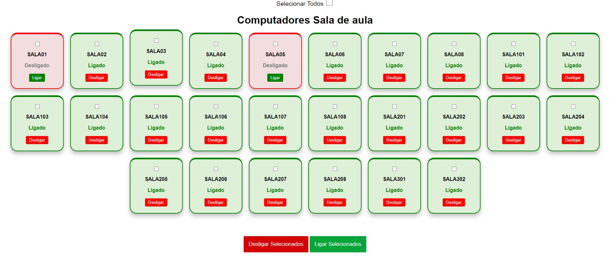
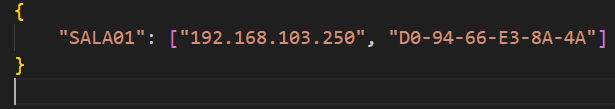

# <h1>Liga/Desliga via Rede</h1>

## Indice:
- <a href='#topico_1'>
Do que se trata?
</a>
- <a href='#topico_2'>
Considerações para funcionamento
</a>
- <a href='#topico_3'>
Como configurar a máquina alvo?
</a>
- <a href='#topico_4'>
Funcionamento e implementação
</a>
   

<h1 id='topico_1'>
Do que se trata?
</h1>
Em um ambiente empresarial, como uma instituição de ensino, os colaboradores de suporte de T.I muitas das vezes precisam caminhar no prédio para ligar computador por computador das salas de aula, ou desligá-los para evitar desperdício de energia, então desenvolvi este sistema onde é possível ligar e desligar os computadores via rede e configurar horários para ligar ou desligar automaticamente.   
Para a ação de ligar uma máquina via rede, a aplicação enviará um <strong>Magic Packet</strong> (nome dado ao pacote via rede para despertar um computador) para a máquina selecionada na interface, sendo assim, ativando sua placa de rede e ligando a mesma, este pacote contém o endereço MAC da máquina destino, este processo é conhecido como <strong>Wake On Lan</strong>.  
Para a ação de desligar uma máquina via rede, a aplicação enviará o comando shutdown remotamente para a máquina selecionada na interface.     

<h1 id ='topico_2'>
Considerações para o funcionamento
</h1>

[X] O servidor da aplicação e as máquinas destino devem estar na mesma faixa de rede.

[X] As máquinas destino devem suportar o Wake On Lan.

   

<h1 id ='topico_3'>
Como configurar a máquina alvo?
</h1>

<h2>Config de Firewall:</h2>

[X] Criar uma regra de entrada no Firewall para protocolo ICMPv4 (Particular, Privada e Publica)

[X] Habilitar "Compartilhamento de Arquivo e Impressora (SMB-Entrada)" e permitir para rede particular, privada e publica.

<h2>Config de bios:</h2>

[X] Habilitar Wake-On-Lan.

 
<h1>
Funcionamento e implementação
</h1>
<h2>Config de ambiente</h2>

<strong>1- Arquivo "main.py": </strong>  
- Atribuir o valor do parâmetro "host" como IP do servidor. (linha 11) 

<strong>2- Arquivo "/api/view/assets/js/scripts.js":</strong> 
- Alterar valor da variável "ip_host" para ip do servidor. (linha 2)

<strong>3- Arquivo "/utils/.env":</strong> 
- Inserir o Json contendo os dados das máquinas destino. Use o seguinte formato:  
{ "Nome da máquina": ["Ip da maquina", "MacAddress da máquina"] }  
Exemplo abaixo:    

<strong>4- Instalar as dependências do projeto > requirements.txt</strong>

<h2>Como rodar?</h2>

Depois de realizar as configurações de ambiente, execute o arquivo <strong>main.py</strong>.  
Após executar, a interface web já estará no ar, pelo endereço <strong>http://ip_do_servidor:81/hosts</strong>

